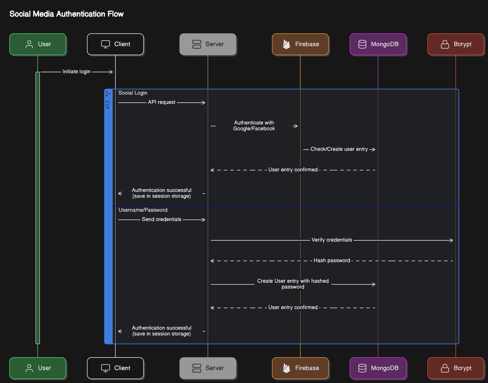

# Social Media Login Service

- GitHub Repo can be found here: [https://github.com/bpyle02/sweng-861-week-2-social-media-login-service](https://github.com/bpyle02/sweng-861-week-2-social-media-login-service)

# Authentication Flow Diagram



# Setting up the Environment

- The environment I am using is MERN (MongoDB, Express JS, React, and Node JS), however, I have added some extra goodies to make things a little easier
    - Vite — A usability tool to make building the frontend super easy
    - Tailwind CSS — A usability tool to make designing the UI super simple and easy
- To run this web app locally, clone the repository and run `npm i` in the frontend and backend folders
- After the frontend and backend are initialized, you can start up the backend by typing `npm start` in the terminal and the frontend by executing the `npm run dev` command
- You will then be able to access the website from [http://localhost:5173](http://localhost:5173). Right now, the website only has functionality to sign in, sign out, and edit your profile, but if you would like to see the fully built application, you can check out [https://christisking.info](https://christisking.info)

# Setting up MongoDB

- Instead of setting up a local instance of MongoDB, I decided to go with their free cloud tier
- To set it up, create an account at https://cloud.mongodb.com/, create a new project and create a database within that project
- Next, go to ‘Secutity’ → ‘Quickstart’ and create a database user
- Then, go to ‘Security’ → ‘Network Access’ → ‘Add IP Address’ and click ‘Allow Access From Anywhere’. Although this isn’t recommended for production environments, it is an easy way to get up and running without having to worry about getting the correct IP (since they often change)
- Now go to ‘Deployment’ → ‘Database’ → ‘Driver’ and make sure Node.js is selected. Copy the connection string and paste it into the DB_LOCATION variable inside the backend .env file
- Your database is all set and ready to go now!

# Setting up Firebase

- Navigate to https://console.firebase.google.com/u/0/, sign in, and click ‘Create an project’
    - Make sure to disable AI assistance and analytics
- Next, click on the ‘Web’ icon under ‘Get started by adding Firebase to your app
- Register your app, copy the code it gives you, and paste it into ./frontend/common/firebase.jsx
- Now, go back to the main page of your firebase project and click on ‘Authentication’ → ‘Add new provider’ → ‘Google’
- Enable it, add your email, and click save
- Now go to ‘Project settings’ → ‘Service accounts’ and click on ‘Generate new private key’
- Copy the contents of the file and paste it into ./backend/etc/secrets/firebase_private_key.json

# Setting up Google Sign In

- Go back to your firebase.jsx app and add the following code
    
    ```jsx
    import { GoogleAuthProvider, FacebookAuthProvider, getAuth, signInWithPopup } from 'firebase/auth'
    
    // Google Authentication
    const google_provider = new GoogleAuthProvider();
    const google_auth = getAuth();
    
    export const authWithGoogle = async () => {
    
        let user = null;
    
        await signInWithPopup(google_auth, google_provider)
        .then((result) => {
            user = result.user
        })
        .catch((err) => {
            console.log(err)
        })
    
        return user;
    }
    
    ```
    
    - This is what allows the popup window to appear and Google Authentication to work when you click on the ‘Sign in with Google’ button
- Now, add the following function to the ‘userAuthForm.jsx’ file
    
    ```jsx
    //Add this function near the top of the file
    const handleGoogleAuth = (e) => {
    
        e.preventDefault();
    
        authWithGoogle().then(user => {
            
            let se rverRoute = "/google-auth";
    
            let formData = {
                access_token: user.accessToken
            }
    
            userAuthThroughServer(serverRoute, formData)
    
        })
        .catch(err => {
            toast.error('trouble login through google');
            return console.log(err)
        })
    
    }
    
    //Add this HTML code below the standard sign in text input boxes
    <button className="btn-dark flex items-center justify-center gap-4 w-[90%] center" onClick={handleGoogleAuth} >
        
        continue with google
    </button>
    ```
    
- Next you’ll need to add a google-auth boolean variable to your User.js schema in order to check which method the user used to sign in. Add it right after the ‘account_info’ variable
    
    ```jsx
    google_auth: {
        type: Boolean,
        default: false
    },
    ```
    
- Finally, you will make 2 edits to your server.js file
    - First, add the following code to your /signin route to make sure users cannot use the standard login method if they already created their account using either Google or Facebook sign in
        
        ```jsx
        if(!user.google_auth || !user.facebook_auth){
        
            bcrypt.compare(password, user.personal_info.password, (err, result) => {
        
                if(err) {
                    return res.status(403).json({ "error": "Error occured while login please try again" });
                }
        
                if(!result){
                    return res.status(403).json({ "error": "Incorrect password" })
                } else{
                    return res.status(200).json(formatDatatoSend(user))
                }
        
            })
        
        } else {
            return res.status(403).json({ "error": "Account was created using an oauth provider. Try logging in with with Facebook or Google." })
        }
        ```
        
    - Next, paste the following post request function into your server.js file in order to enable Google authentication in the backend. This function will also save the user data to the database
        
        ```jsx
        server.post("/google-auth", async (req, res) => {
        
            let { access_token } = req.body;
        
            getAuth()
            .verifyIdToken(access_token)
            .then(async (decodedUser) => {
        
                let { email, name, picture } = decodedUser;
                let isAdmin = false;
                
                if (process.env.ADMIN_EMAILS.split(",").includes(email)) {
                    isAdmin = true;
                }
        
                picture = picture.replace("s96-c", "s384-c");
        
                let user = await User.findOne({"personal_info.email": email}).select("personal_info.fullname personal_info.username personal_info.profile_img admin google_auth facebook_auth").then((u) => {
                    return u || null
                })
                .catch(err => {
                    return res.status(500).json({ "error": err.message })
                })
        
                if(user) { // login
                    if(!user.google_auth){
                        return res.status(403).json({ "error": "This email was signed up without google. Please log in with password to access the account" })
                    }
                }
                else { // sign up
                    
                    let username = await generateUsername(email);
        
                    user = new User({
                        personal_info: { fullname: name, email, username, profile_img: picture },
                        admin: isAdmin,
                        google_auth: true,
                        facebook_auth: false
                    })
        
                    await user.save().then((u) => {
                        user = u;
                    })
                    .catch(err => {
                        return res.status(500).json({ "error": err.message })
                    })
        
                }
        
                console.log("You successfully signed in with Google!")
                return res.status(200).json(formatDatatoSend(user))
        
            })
            .catch(err => {
                return res.status(500).json({ "error": "Failed to authenticate you with google. Try with some other google account" })
            })
        
        })
        ```
        

# Setting up Facebook Sign In

- Unfortunately, Facebook sign in only works for my account because you have to have a business account for it to work in production. However, I will still explain how to set it up.
- First, go back to the main page of your firebase project and click on ‘Authentication’ → ‘Add new provider’ → ‘Facebook’ and copy the ‘Callback URL’
- Then, go to [https://developers.facebook.com](https://developers.facebook.com) and create and app
- Select ‘Authenticate and request data from users for Facebook Login’ as the app use case
- Don’t add a business account unless you have one you want to use and then click ‘Go to dashboard’
- Next, click on ‘Customize adding a Facebook Login button’ from the dashboard page and add the email permission
- From the Facebook Login sidebar menu, click on ‘Settings’ and paste in the ‘Callback URL’ you copied from Firebase into the ‘Redirect URI to Check’ box and save
- Now go down to ‘Quickstart’ on the sidebar and click on ‘Web’
- In the ‘Site URL’ input box, paste in [http://localhost](http://localhost) if you are testing or the domain you are using if the site is in  production
- Now it’s time to do some coding! First, paste the code below into the ‘firebase.jsx’ file
    
    ```jsx
    // Facebook Authentication
    const facebook_provider = new FacebookAuthProvider();
    const facebook_auth = getAuth();
    
    export const authWithFacebook = async () => {
    
        let user = null;
    
        await signInWithPopup(facebook_auth, facebook_provider)
        .then((result) => {
            user = result.user
        })
        .catch((err) => {
            console.log(err)
        })
    
        return user;
    }
    ```
    
- Now, add the following function to the ‘userAuthForm.jsx’ file
    
    ```jsx
    //Add this function to the top of the file
    const handleFacebookAuth = (e) => {
    
        e.preventDefault();
    
        authWithFacebook().then(user => {
            
            let serverRoute = "/facebook-auth";
    
            let formData = {
                access_token: user.accessToken
            }
    
            userAuthThroughServer(serverRoute, formData)
    
        })
        .catch(err => {
            toast.error('trouble login through facebook');
            return console.log(err)
        })
    
    }
    
    //Add this HTML code below the standard sign in text input boxes
    <button className="btn-dark flex items-center justify-center gap-4 w-[90%] center mt-2" onClick={handleFacebookAuth}>
        
        continue with facebook
    </button>
    ```
    
- Next you’ll need to add a facebook-auth boolean variable to your User.js schema in order to check which method the user used to sign in. Add it right after the ‘account_info’ variable
    
    ```jsx
    facebook_auth: {
        type: Boolean,
        default: false
    },
    ```
    
- Next, paste the following post request function into your server.js file in order to enable Facebook authentication in the backend. This function will also save the user data to the database
    
    ```jsx
    server.post("/facebook-auth", async (req, res) => {
    
        let { access_token } = req.body;
        
        
        getAuth()
        .verifyIdToken(access_token)
        .then(async (decodedUser) => {
            
            let { email, name, picture } = decodedUser;
            let isAdmin = false;
            
            if (process.env.ADMIN_EMAILS.split(",").includes(email)) {
                isAdmin = true;
            }
    
            let user = await User.findOne({"personal_info.email": email}).select("personal_info.fullname personal_info.username personal_info.profile_img admin google_auth facebook_auth").then((u) => {
                return u || null
            })
            .catch(err => {
                return res.status(500).json({ "error": err.message })
            })
    
            if(user) { // login
                if(!user.facebook_auth){
                    return res.status(403).json({ "error": "This email was signed up without facebook. Please log in with password to access the account" })
                }
            }
            else { // sign up
                
                let username = await generateUsername(email);
    
                user = new User({
                    personal_info: { fullname: name, email, username, profile_img: picture },
                    admin: isAdmin,
                    google_auth: false,
                    facebook_auth: true
                })
    
                await user.save().then((u) => {
                    user = u;
                })
                .catch(err => {
                    return res.status(500).json({ "error": err.message })
                })
    
            }
    
            console.log("You successfully signed in with Facebook!")
            return res.status(200).json(formatDatatoSend(user))
    
        })
        .catch(err => {
            return res.status(500).json({ "error": "Failed to authenticate you with facebook. Try with some other google account" })
        })
    
    })
    ```
    

# Error Handling

- For error handling, a combination of console logs for more advanced error handling and Toast for user-facing popup notifications
- `console.log` example:
    
    ```jsx
    //In this example, if a user attempts to log in with Facebook using an email
    //that was already used to sign using another method, the function will return
    //a 403 (forbidden) error and explain the issue in a json format 
    if(!user.facebook_auth){
        return res.status(403).json({ "error": "This email was signed up without facebook. Please log in with password to access the account" })
    }
    ```
    
- If this situation occurs, the frontend will generate an error popup using toast and output the full error message to the console:
    
    ```jsx
    //If any errors occur while logging in with Facebook, this message will pop up
    //and the full error will be output to the console
    .catch(err => {
        toast.error('Trouble logging in through Facebook');
        return console.log(err)
    })
    ```
    

# Security Considerations and Measures

- For security, I am using cloud-based storage solutions for user authentication (Firebase) and storage (MongoDB) these inherently have much better security than a custom-made self-hosted solution.
- Users that sign in with Google and Facebook do not share any password data to the website’s database. That means that, even if someone did get access to the database, the would only be able to access the user’s name, email, and profile picture.
- Additionally, if a user does sign in with an email and username, bcrypt (a password hashing library) is used to hash all passwords before storing them in the database.